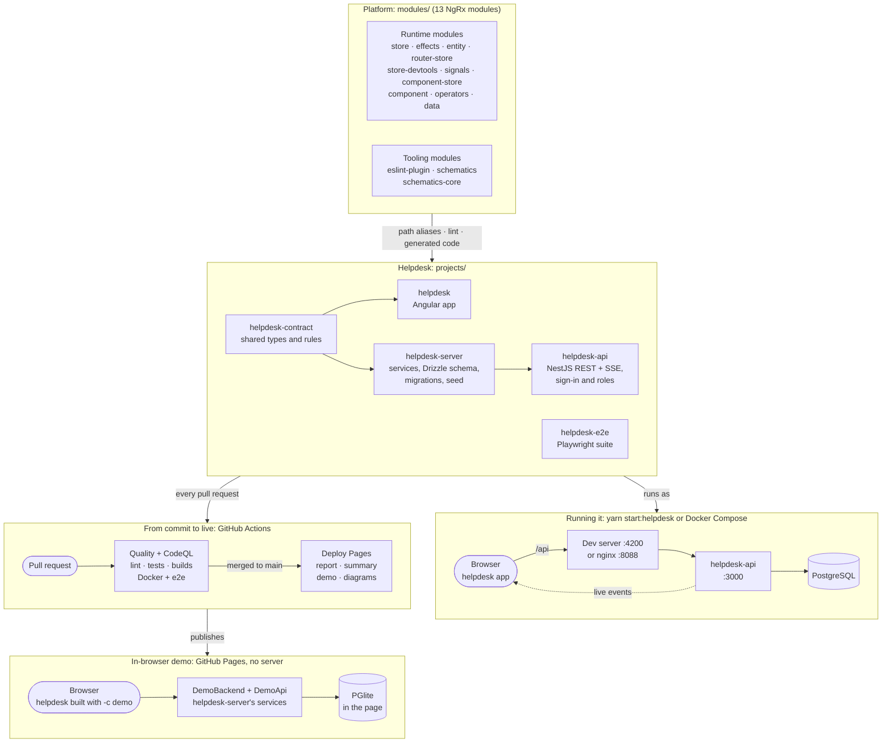

# How It Fits Together

This repository has two halves that work as one:

- **The platform:** the 13 NgRx modules under `modules/`, rebuilt module by module. Ten are runtime libraries (state, effects, signals, entities and so on); three are tooling (the ESLint plugin and the schematics).
- **The Helpdesk app** under `projects/`: a real help desk (Angular front end, NestJS API, PostgreSQL) built on those modules, so every module does real work in a real app, not only in its own specs.

The diagram shows the whole of it, from the modules' source to a ticket on someone's screen, and from a pull request to the live demo. The sections after it walk through each part.

## The big picture

## The platform: 13 modules

Each module lives in `modules/<name>` with its source, specs and type tests, and builds on its own with `ng-packagr` (`yarn build`). The app doesn't install them from npm: the root `tsconfig.json` maps every `@ngrx/*` import to that module's source, so the app compiles the modules' current code directly. A change to a module shows up in the app on the next build, with nothing to publish in between.

The three tooling modules work differently:

- **`eslint-plugin`** lints the app. `projects/helpdesk/eslint.config.mjs` loads the plugin's built copy from `dist/`, so the plugin builds before the app is linted.
- **`schematics`** and **`schematics-core`** generated code rather than running in it: the landing page's state began as `nx g @ngrx/schematics:entity`, then was adapted.

Which module powers which part of the app is listed in the summary that closed the Helpdesk epic ([#303](https://github.com/Terrence721/platform-main/issues/303)).

## The Helpdesk app

Five projects, each with one job:

| Project             | Job                                                                                                                                                                                                  |
| ------------------- | ---------------------------------------------------------------------------------------------------------------------------------------------------------------------------------------------------- |
| `helpdesk-contract` | The types and rules both sides share: tickets, roles, the ticket workflow, live events, report shapes. Imported by the app, the API and the server library alike, so the two ends can't drift apart. |
| `helpdesk`          | The Angular app. Each page (agent, supervisor, admin) has its own signal store (`rxMethod`, `withEntities`); the session, the landing page and router state use the NgRx store and effects.          |
| `helpdesk-api`      | The NestJS API: sign-in with a JWT cookie, role guards (`@OnlyFor`), and one module per feature (`auth`, `tickets`, `teams`, `users`, `reports`, `live`).                                            |
| `helpdesk-server`   | The services behind the API, the Drizzle schema, the SQL migrations (`drizzle/`) and the seed. Plain TypeScript with no HTTP, so the same code also runs in the browser for the demo.                |
| `helpdesk-e2e`      | Playwright tests against the real Docker Compose stack: sign-in, a journey per role, and live updates in two browsers at once.                                                                       |

## Running it

The browser only ever talks to its own origin. In development (`yarn start:helpdesk`) the Angular dev server on port 4200 forwards `/api/*` to the API on 3000. In Docker (`docker compose --profile full up`, or `yarn start:helpdesk:docker`) nginx on port 8088 serves the built app and forwards `/api/*` the same way. PostgreSQL runs in Docker Compose either way. In development the launcher wipes it, migrates and seeds it on every start; in Docker the API's container migrates it and seeds it when it's empty.

**Live updates** flow the other way. When a ticket, a message or an account changes, the service publishes a notice (no ticket data) to an in-memory hub. The API streams the notices each person may see over server-sent events on `/api/events`. An open page that hears one reloads what it shows through the normal API, so the stream never bypasses the role checks.

## The in-browser demo

The live demo on GitHub Pages ([terrence721.github.io/platform-main/helpdesk/](https://terrence721.github.io/platform-main/helpdesk/)) is the same app with no server at all. It's built with `-c demo`, which swaps Angular's `HttpBackend` for `DemoBackend`. Every API call is answered in the page by `DemoApi`, which runs `helpdesk-server`'s real services against PGlite, PostgreSQL compiled to WebAssembly, with the same migrations and a fresh seed. It keeps each NestJS controller's access rules, so the demo refuses what the real API refuses.

## From commit to live

Every pull request runs the **Quality** workflow: ESLint, Vitest, the module builds, a Prettier check, and the **Docker images (helpdesk)** job, which builds both images, starts the whole stack and runs the Playwright suite against it. **CodeQL** scans every pull request too. Once a merge to `main` passes Quality, **Deploy Pages** publishes the HTML test report, the summary page, the in-browser demo and the diagram pages.

## Where to look

| Part                               | Where                                                                                                              |
| ---------------------------------- | ------------------------------------------------------------------------------------------------------------------ |
| A module's source and specs        | `modules/<name>/src`, `modules/<name>/spec`                                                                        |
| How the app reaches the modules    | `tsconfig.json` (`paths`)                                                                                          |
| Shared types and rules             | `projects/helpdesk-contract/src/lib`                                                                               |
| The app's pages and stores         | `projects/helpdesk/src/app/<page>`                                                                                 |
| The API's routes                   | `projects/helpdesk-api/src/<feature>/*.controller.ts`                                                              |
| Services, schema, migrations, seed | `projects/helpdesk-server/src/lib`, `projects/helpdesk-server/drizzle`                                             |
| Live updates                       | `helpdesk-server/src/lib/live`, `helpdesk-api/src/live`, `helpdesk/src/app/live`                                   |
| The demo's backend                 | `projects/helpdesk/src/demo`                                                                                       |
| Docker                             | `compose.yaml`, `projects/helpdesk-api/Dockerfile`, `projects/helpdesk/Dockerfile`, `projects/helpdesk/nginx.conf` |
| End-to-end tests                   | `projects/helpdesk-e2e/src`                                                                                        |
| CI and deployment                  | `.github/workflows/quality.yml`, `codeql.yml`, `pages.yml`                                                         |

The other diagrams, linked from the [README](../README.md#-start-here), go deeper into single parts: the module dependency tiers, the composition-over-inheritance redesigns, the code-review pipeline and the effects runtime.
